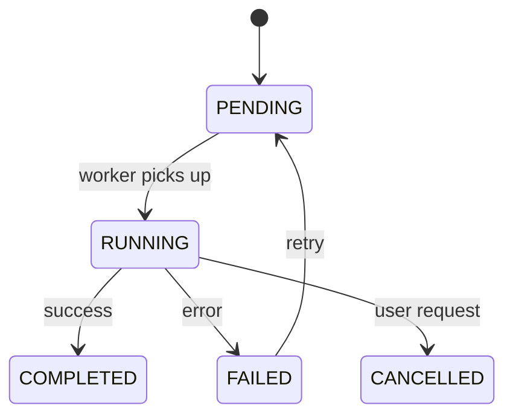
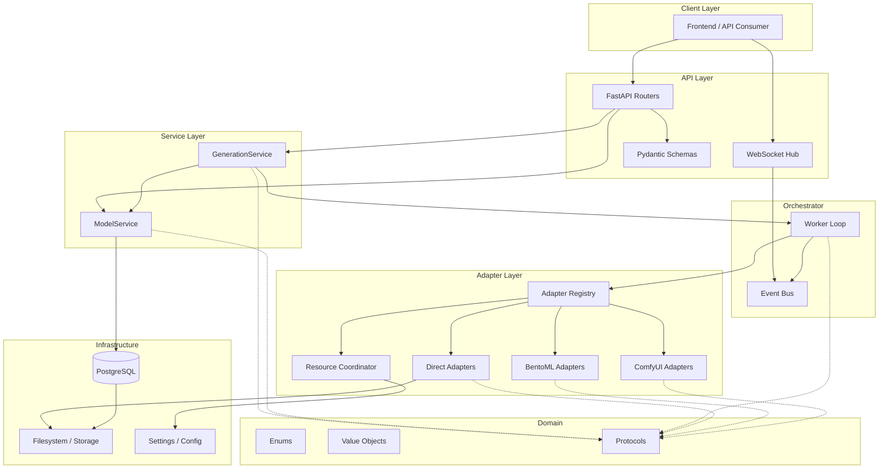

# Step 6 — Code Quality, Documentation System, and Final Architecture Summary

> **Purpose**: Define the complete tooling stack, enforcement rules, documentation architecture, commenting policy, and educational strategy — then close with a consolidated view of the entire intended system.

---

## 1. Python Tooling Stack

One toolchain, zero ambiguity. Every tool chosen here replaces multiple older tools and is configured in a single `pyproject.toml`.

| Tool | Replaces | Purpose |
|------|----------|---------|
| **Ruff** (lint mode) | flake8, pylint, pycodestyle, pydocstyle, isort, bandit, eradicate | All linting + import sorting in one pass |
| **Ruff** (format mode) | Black, autopep8, yapf | Deterministic formatting |
| **mypy** (strict) | — | Static type checking with SQLAlchemy + Pydantic plugins |
| **pytest** | unittest | Test runner with async support |
| **pre-commit** | manual checks | Git hooks enforce rules before every commit |
| **markdownlint-cli2** | — | Documentation Markdown linting |

### Why not Black + isort + flake8 separately?

Ruff does all three in a single binary at 10–100× the speed. Fewer configs, fewer conflicts, one source of truth.

### Why not Prettier for Python?

Prettier targets JavaScript/TypeScript. Ruff format is the Python-native equivalent with identical determinism guarantees.

### Where Prettier IS used

Only for non-Python files that benefit from it:

```yaml
# .prettierrc (root)
overrides:
  - files: ["*.md", "*.json", "*.yaml", "*.yml"]
    options:
      proseWrap: always
      tabWidth: 2
      printWidth: 100
```

Prettier touches Markdown/JSON/YAML formatting only — never Python.

---

## 2. Ruff Configuration (Complete)

Already defined in `backend/pyproject.toml`. Here is the rationale for every rule group:

### Lint Rules Enabled

| Code | Plugin | Why |
|------|--------|-----|
| `E`, `W` | pycodestyle | Basic PEP 8 compliance |
| `F` | pyflakes | Unused imports/variables, undefined names |
| `I` | isort | Consistent, deterministic import ordering |
| `N` | pep8-naming | Enforces class/function/variable naming conventions |
| `UP` | pyupgrade | Auto-modernizes syntax to Python 3.11+ |
| `B` | bugbear | Catches common bugs and design mistakes |
| `SIM` | simplify | Reduces unnecessary complexity |
| `TCH` | type-checking | Moves typing-only imports behind `TYPE_CHECKING` |
| `RUF` | ruff-specific | Ruff's own high-quality rules |
| `D` | pydocstyle | Enforces Google-style docstrings on all public APIs |
| `ANN` | annotations | Requires type hints on all parameters/returns |
| `C4` | comprehensions | Simplifies list/dict/set comprehensions |
| `PTH` | use-pathlib | Enforces `pathlib.Path` over `os.path` |
| `S` | bandit | Security anti-patterns (SQL injection, hardcoded secrets) |
| `T20` | no-print | Prevents `print()` in production code (use logging) |
| `ERA` | eradicate | Flags commented-out code (dead code hiding) |
| `PL` | pylint-subset | Function argument/return/branch limits |
| `PERF` | perflint | Performance anti-patterns |
| `C90` | mccabe | Cyclomatic complexity ceiling |

### Key Ignores and Why

```toml
ignore = [
    "D100",   # Module docstrings enforced selectively, not universally
    "D104",   # __init__.py docstrings are optional (package tree is self-documenting)
    "D203",   # Conflicts with D211 (Google style uses no-blank-before-class)
    "D213",   # Conflicts with D212 (Google style: summary on first line)
    "ANN101", # `self` doesn't need annotation (obvious)
    "ANN102", # `cls` doesn't need annotation (obvious)
    "ANN401", # typing.Any is needed in adapter internals (ML libraries)
    "S101",   # assert is valid in tests
]
```

### Per-File Relaxations

```toml
[tool.ruff.lint.per-file-ignores]
"tests/**/*.py" = ["D", "ANN", "S101", "PLR2004"]   # Tests: no docstrings, loose typing
"app/adapters/**/*.py" = ["ANN401"]                  # Adapters: Any allowed (torch types)
```

---

## 3. Formatting Rules

| Rule | Setting | Rationale |
|------|---------|-----------|
| Quote style | `"double"` | Consistent, avoids apostrophe conflicts in English strings |
| Indent style | spaces (4) | PEP 8 standard |
| Line length | 100 | Readable on a single laptop screen without scrolling |
| Line ending | `auto` | Respects OS conventions, Git handles normalization |
| Docstring code format | `true` | Code examples inside docstrings get formatted too |
| Trailing commas | Always on multi-line | Cleaner diffs, easier reordering |

---

## 4. Import Ordering Rules

Managed by Ruff's isort implementation:

```
Section 1 — __future__ imports
Section 2 — Standard library (asyncio, pathlib, uuid, ...)
Section 3 — Third-party (fastapi, pydantic, sqlalchemy, torch, ...)
Section 4 — First-party (app.domain, app.services, app.adapters, ...)
```

### Enforced behaviors

- **Two blank lines** after imports before code starts
- **No wildcard imports** (`from x import *`) — ever
- **No relative cross-package imports** — always absolute from `app.`
- **Relative imports** allowed only within the same sub-package (e.g., `from .base import Base`)
- **`from __future__ import annotations`** in every module (enables `str | None` syntax, deferred evaluation)

---

## 5. Typing Rules (mypy strict)

```toml
[tool.mypy]
strict = true
disallow_untyped_defs = true
disallow_incomplete_defs = true
warn_return_any = true
warn_unused_configs = true
plugins = ["pydantic.mypy", "sqlalchemy.ext.mypy.plugin"]
```

### What strict mode enforces

| Check | Effect |
|-------|--------|
| `disallow_untyped_defs` | Every function must have full type signatures |
| `disallow_incomplete_defs` | No mixing typed and untyped parameters |
| `warn_return_any` | Must explicitly handle `Any` returns from external libs |
| `check_untyped_defs` | Even untyped functions get their body checked |
| No implicit `Optional` | Must write `str | None`, not rely on `= None` default |

### External library overrides

ML libraries ship without type stubs. Suppressed via:

```toml
[[tool.mypy.overrides]]
module = ["diffusers.*", "transformers.*", "torch.*", "bentoml.*", ...]
ignore_missing_imports = true
```

### Typing conventions in code

```python
# ✅ Good: Explicit, readable
def submit_job(params: GenerationParams, model_id: str) -> UUID: ...

# ✅ Good: Union with None expressed with |
def find_model(model_id: str) -> ModelRecord | None: ...

# ✅ Good: Callback types are explicit
ProgressSubscriber = Callable[[JobProgress], Awaitable[None]]

# ❌ Bad: No annotation
def submit_job(params, model_id): ...

# ❌ Bad: Using Optional instead of |
def find_model(model_id: str) -> Optional[ModelRecord]: ...
```

---

## 6. Naming Rules (Comprehensive Reference)

This consolidates and extends the conventions from Step 2 into a complete decision table:

### Python identifiers

| What | Convention | Pattern | Example |
|------|-----------|---------|---------|
| Module file | `snake_case.py` | `<noun>` or `<noun>_<noun>.py` | `model_service.py` |
| Package directory | `snake_case/` | `<noun>/` | `adapters/`, `direct/` |
| Class | `PascalCase` | `<Adjective?><Noun><Role>` | `DirectTextToImageAdapter` |
| Function | `snake_case` | `<verb>_<object>` | `submit_job`, `load_model` |
| Private method | `_snake_case` | `_<verb>_<object>` | `_build_pipeline` |
| Constant | `UPPER_SNAKE_CASE` | `<NOUN>_<QUALIFIER>` | `MAX_VRAM_MB` |
| Variable | `snake_case` | descriptive, never single-char except `i/j/k` in loops | `active_jobs` |
| Type alias | `PascalCase` | `<Noun>` | `ProgressSubscriber` |
| Enum class | `PascalCase` | `<Noun>` | `JobStatus`, `ModelSource` |
| Enum member | `UPPER_SNAKE_CASE` | `<NOUN>` | `JobStatus.RUNNING` |

### Suffixes by architectural role

| Role | Suffix | Lives in | Example |
|------|--------|----------|---------|
| Service | `Service` | `services/` | `ModelService` |
| Repository | `Repository` | `infrastructure/database/repositories/` | `JobRepository` |
| Adapter | `Adapter` | `adapters/` | `DirectVideoAdapter` |
| Protocol | `Provider` / `Manager` | `domain/protocols.py` | `TextToImageProvider` |
| Request schema | `Request` | `api/schemas/` | `TextToImageRequest` |
| Response schema | `Response` | `api/schemas/` | `JobStatusResponse` |
| ORM model | `Record` | `infrastructure/database/models.py` | `ModelRecord` |
| Value object | (descriptive) | `domain/value_objects.py` | `GenerationParams` |
| Settings | `Settings` | `infrastructure/config/settings.py` | `Settings` |
| Event | `Event` | `orchestrator/event_bus.py` | `JobProgressEvent` |
| Exception | `Error` | module that raises it | `ModelNotFoundError` |

### Database naming

| Element | Convention | Example |
|---------|-----------|---------|
| Tables | `plural_snake_case` | `models`, `job_events` |
| Columns | `snake_case` | `model_id`, `created_at` |
| Foreign keys | `<singular_table>_id` | `model_id`, `job_id` |
| Indexes | `ix_<table>_<columns>` | `ix_jobs_status_created` |
| Unique constraints | `uq_<table>_<columns>` | `uq_models_model_id` |
| Check constraints | `ck_<table>_<column>` | `ck_jobs_status_valid` |

---

## 7. Complexity and File-Size Rules

### Hard limits (machine-enforced)

| Rule | Limit | Enforced by |
|------|-------|-------------|
| Cyclomatic complexity per function | ≤ 10 | Ruff `C90` |
| Arguments per function | ≤ 7 | Ruff `PL` (PLR0913) |
| Return statements per function | ≤ 6 | Ruff `PL` (PLR0911) |
| Branches per function | ≤ 12 | Ruff `PL` (PLR0912) |
| Statements per function | ≤ 50 | Ruff `PL` (PLR0915) |
| Line length | ≤ 100 | Ruff formatter |

### Soft limits (developer discipline)

| Rule | Limit | What to do when exceeded |
|------|-------|--------------------------|
| Module (file) size | ~300 lines | Split into focused sub-modules |
| Class size | ~200 lines | Extract helper/mixin/sub-class |
| Router file | ~10 endpoints | Create sub-routers |
| Service method | ~30 lines | Extract private helpers |
| Nesting depth in `app/` | 3 levels max | Flatten package structure |
| Test file | 1:1 with source | `test_model_service.py` ↔ `model_service.py` |

### Escape hatch

When a function legitimately requires more complexity (e.g., a state machine transition table), add:

```python
# ruff: noqa: C901  — state machine, irreducible complexity
def _transition_job_state(current: JobStatus, event: str) -> JobStatus:
    ...
```

Document the exception. Never suppress silently.

---

## 8. Pre-commit Configuration

```yaml
# .pre-commit-config.yaml (backend root)
repos:
  - repo: local
    hooks:
      - id: ruff-check
        name: Ruff lint
        entry: ruff check --fix
        language: system
        types: [python]
        pass_filenames: true

      - id: ruff-format
        name: Ruff format
        entry: ruff format
        language: system
        types: [python]
        pass_filenames: true

      - id: mypy
        name: mypy type check
        entry: mypy
        language: system
        types: [python]
        pass_filenames: false
        args: [--config-file, pyproject.toml]

  - repo: https://github.com/DavidAnson/markdownlint-cli2
    rev: v0.13.0
    hooks:
      - id: markdownlint-cli2
        args: [--config, .markdownlint.yaml]
```

### Workflow

```
git commit → pre-commit fires → ruff lint → ruff format → mypy → markdownlint
                                      ↓ fail = commit blocked
```

Every commit in the repository is guaranteed to pass lint + format + type checks. No exceptions.

---

## 9. Documentation Architecture

### Two audiences, two systems

```
┌─────────────────────────────────────────────────────────────┐
│                    DOCUMENTATION                              │
├─────────────────────────┬───────────────────────────────────┤
│   Developer docs        │   Knowledge base                  │
│   (in-code + /docs)     │   (theory + workflows)            │
├─────────────────────────┼───────────────────────────────────┤
│ • Architecture decisions│ • AI/ML theory guides             │
│ • API reference (auto)  │ • Diffusion explained             │
│ • Module guides         │ • Transformers explained          │
│ • Setup/deploy guides   │ • Video generation explained      │
│ • Contribution rules    │ • Local LLMs explained            │
│ • Troubleshooting       │ • Workflow recipes                │
│                         │ • Prompt engineering              │
│                         │ • Glossary                        │
│                         │ • Troubleshooting                 │
└─────────────────────────┴───────────────────────────────────┘
```

### Directory layout

```
docs/
├── architecture/                  # Design decisions (Steps 1–6)
│   ├── step-2-project-structure.md
│   ├── step-3-domain-storage-database.md
│   ├── step-4-api-orchestration-lifecycle.md
│   ├── step-5-inference-execution.md
│   └── step-6-code-quality-documentation.md
│
├── guides/                        # Developer how-tos
│   ├── setup.md                   # Environment setup, first run
│   ├── development.md             # Daily dev workflow, debugging
│   ├── adding-adapters.md         # How to add a new inference backend
│   ├── adding-endpoints.md        # How to add a new API route
│   └── deployment.md              # Docker, production configs
│
├── knowledge/                     # Educational content (theory)
│   ├── diffusion/
│   │   ├── what-is-diffusion.md
│   │   ├── stable-diffusion-pipeline.md
│   │   ├── schedulers-explained.md
│   │   └── controlnet-and-lora.md
│   ├── transformers/
│   │   ├── attention-mechanism.md
│   │   ├── tokenizers.md
│   │   └── vision-transformers.md
│   ├── video/
│   │   ├── video-generation-overview.md
│   │   └── temporal-consistency.md
│   ├── llm/
│   │   ├── local-llm-overview.md
│   │   ├── quantization.md
│   │   └── context-window-management.md
│   └── glossary.md
│
├── workflows/                     # Practical recipes
│   ├── text-to-image-workflow.md
│   ├── image-to-image-workflow.md
│   ├── batch-generation.md
│   ├── model-management-workflow.md
│   └── troubleshooting.md
│
└── diagrams/                      # Source for all Mermaid diagrams
    ├── system-overview.mmd
    ├── job-state-machine.mmd
    ├── model-lifecycle.mmd
    ├── inference-flow.mmd
    └── layer-dependencies.mmd
```

---

## 10. ADHD-Friendly Documentation Principles

Every document in this project follows these structural rules:

### Visual hierarchy

1. **TL;DR at the top** — Every doc starts with a 1–3 sentence summary in a blockquote
2. **Mermaid diagrams before text** — Show the shape first, explain after
3. **Tables over paragraphs** — Scannable > readable for reference material
4. **Bold key terms** — The eye catches bold before anything else
5. **Short paragraphs** — Max 3–4 sentences before a break
6. **Numbered steps** — For anything sequential
7. **Code examples immediately** — Don't explain for 5 paragraphs before showing code

### Navigation

- Every doc has a clear heading structure (`##` for sections, `###` for sub-points)
- No heading nesting deeper than `####`
- Table of contents for any doc longer than 3 screens
- Cross-links between related docs (not "see also" dumps — specific "if you need X, see Y")

### Tone

- Direct and declarative ("This service does X" not "This service is designed to do X")
- Active voice always
- No filler words ("basically", "essentially", "in order to")
- Concrete examples over abstract explanations

### Cognitive load management

- **One concept per section** — Never mix two ideas in one heading
- **Decision tables** — When choices exist, present them as comparison tables
- **"Why?"** — Every non-obvious design decision includes a brief justification inline
- **Progressive disclosure** — Summary → details → deep-dive (never forced to read everything)

---

## 11. Diagram Strategy

All architectural diagrams use **Mermaid** syntax stored as `.mmd` files in `docs/diagrams/`.

### Why Mermaid

- Text-based → lives in Git, diffs cleanly, no binary blobs
- Renders natively in GitHub Markdown
- Easy to update alongside code changes
- No external tools needed to create or view

### Diagram types used

| Diagram | Tool | Where used |
|---------|------|-----------|
| System overview | Mermaid `graph TD` | Architecture docs, README |
| State machines | Mermaid `stateDiagram-v2` | Job lifecycle, model lifecycle |
| Sequence flows | Mermaid `sequenceDiagram` | API request → job → result flow |
| Entity relationships | Mermaid `erDiagram` | Database schema |
| Layer dependencies | Mermaid `graph TD` | Module boundary docs |
| Class relationships | ASCII art | Inline in code where helpful |

### Embedding rule

Diagrams are embedded in Markdown docs via fenced code blocks:

````markdown

````

Source `.mmd` files in `docs/diagrams/` are the canonical versions — inline copies are for convenience.

---

## 12. Code Commenting Policy

### Philosophy

Comments exist to explain **why**, not **what**. The code tells you what it does; the comment tells you why it does it that way, what constraint it satisfies, or what would break if you changed it.

### When to comment

| Situation | Required? | Example |
|-----------|-----------|---------|
| Non-obvious algorithm choice | ✅ Yes | Why LRU over LFU for pipeline cache |
| Business rule / domain constraint | ✅ Yes | Why models must be verified before load |
| Workaround for external bug | ✅ Yes | `# diffusers 0.30.x crashes without this` |
| Performance-critical path | ✅ Yes | Why we pre-allocate instead of append |
| Complex regex or formula | ✅ Yes | What the pattern matches |
| Obvious getter/setter | ❌ No | Don't clutter |
| Code that reads like English | ❌ No | `if job.is_cancelled: return` |

### Docstring format (Google style)

```python
def submit_text_to_image(
    self,
    params: GenerationParams,
    model_id: str,
) -> UUID:
    """Submit a text-to-image generation job to the queue.

    Creates a job record, validates that the requested model is available
    and loaded, then enqueues the job for the worker to pick up.

    Args:
        params: Immutable generation parameters (prompt, steps, cfg, seed, etc.).
        model_id: Unique identifier of the model to use for generation.

    Returns:
        The UUID of the created job, usable for status polling and WebSocket
        subscription.

    Raises:
        ModelNotFoundError: If model_id doesn't exist in the catalog.
        ModelNotLoadedError: If the model exists but isn't loaded into memory.
    """
```

### Class docstrings

```python
class DirectTextToImageAdapter:
    """Runs text-to-image inference directly via diffusers StableDiffusionPipeline.

    This adapter owns the lifecycle of the in-process pipeline instance.
    It handles prompt encoding, scheduler selection, and output tensor
    decoding to PIL images.

    The adapter does NOT manage model downloads or VRAM budgets — those
    responsibilities belong to ModelService and ResourceCoordinator respectively.

    Implements: TextToImageProvider (domain/protocols.py)
    """
```

### Module-level docstrings

```python
"""
Model service — business logic for the model catalog and lifecycle.

This module orchestrates model registration, download management, integrity
verification, and load/unload operations. It delegates actual file I/O to
the StorageManager and actual inference-engine loading to the adapters.

Key responsibilities:
    - Register models from Hugging Face, Civitai, or local imports
    - Track download progress and support resume
    - Verify file integrity (SHA256) before allowing model load
    - Coordinate load/unload with the ResourceCoordinator

Layer: Services (imports from Infrastructure + Domain only)
"""
```

### Inline comments

```python
# --- Good: Explains WHY ---

# VRAM budget check BEFORE loading to avoid OOM kill mid-load.
# diffusers doesn't gracefully handle partial loads.
if required_vram > available_vram:
    raise InsufficientVRAMError(required=required_vram, available=available_vram)

# Use fp16 by default — halves VRAM usage with negligible quality loss
# for Stable Diffusion models. Only fall back to fp32 for inpainting.
dtype = torch.float16 if not params.requires_full_precision else torch.float32

# --- Bad: Repeats the code ---

# Check if VRAM is sufficient
if required_vram > available_vram:  # ← Useless, obvious from code

# Set dtype to float16
dtype = torch.float16  # ← Adds zero information
```

### Section markers in longer files

For files approaching the 300-line soft limit, use section markers:

```python
# ═══════════════════════════════════════════════════════════════
# PUBLIC API
# ═══════════════════════════════════════════════════════════════

def submit_job(...): ...
def cancel_job(...): ...

# ═══════════════════════════════════════════════════════════════
# INTERNAL HELPERS
# ═══════════════════════════════════════════════════════════════

def _validate_params(...): ...
def _enqueue(...): ...
```

---

## 13. SOLID Principles — Applied to This Architecture

### S — Single Responsibility

| Layer | Single responsibility |
|-------|---------------------|
| Domain | Define contracts and shapes. No I/O, no logic. |
| Infrastructure | Talk to external systems (DB, disk). No business rules. |
| Adapters | Execute inference. No job management, no API concerns. |
| Services | Orchestrate business logic. No HTTP awareness, no inference details. |
| Orchestrator | Manage job queue lifecycle. No business decisions. |
| API | HTTP ↔ service translation. No logic beyond validation. |

Each class, each module, each layer has **one reason to change**.

### O — Open/Closed

The inference layer is the textbook example:

- **Open for extension**: Add `app/adapters/tensorrt/` → implement protocols → register in adapter registry. Zero changes to services or API.
- **Closed for modification**: Adding TensorRT doesn't touch `DirectTextToImageAdapter` or `GenerationService`.

### L — Liskov Substitution

All adapter backends (`direct/`, `bentoml/`, `comfyui/`) implement the same Protocols. The service layer can swap between them without knowing or caring. If `DirectTextToImageAdapter` is replaced by `BentoMLTextToImageAdapter`, behavior is identical from the caller's perspective.

### I — Interface Segregation

Protocols are small and focused:

```python
class TextToImageProvider(Protocol):
    async def generate(self, params: GenerationParams) -> list[ArtifactReference]: ...

class ModelManager(Protocol):
    async def load(self, model_id: str) -> None: ...
    async def unload(self, model_id: str) -> None: ...
    async def is_loaded(self, model_id: str) -> bool: ...
```

No god-interface. A video adapter doesn't need to know about LLM methods.

### D — Dependency Inversion

- Services depend on `TextToImageProvider` (protocol) — never on `DirectTextToImageAdapter` (concrete)
- The composition root (`app/main.py`) wires concrete implementations to abstract protocols
- Adapters depend on domain protocols for their contract definition
- No layer depends on a concrete class in a layer above it

---

## 14. KISS — Keep It Simple, Stupid

### How simplicity is maintained

| Decision | Simpler alternative rejected | Why |
|----------|------------------------------|-----|
| In-process job queue | No Celery/Redis/RabbitMQ | One process, one machine, no distributed complexity |
| Protocol over ABC | No metaclass magic, no registration decorators | Plain duck-typing with static checking |
| Ruff replaces 5 tools | No flake8 + isort + black + bandit + pydocstyle | One config, one binary, zero conflicts |
| Flat package structure | No 6-level nested packages | Searchable in ≤ 3 clicks |
| Google-style docstrings | No custom docstring format | Industry standard, tooling support |
| Single `enums.py` file | No scattered constants | One place to look, one place to update |
| UUID primary keys | No composite keys, no sequence coordination | Simple, conflict-free, portable |

### Simplicity rules

1. **If a module needs a README to explain its structure, it's too complex — restructure it**
2. **If a function needs more than 7 arguments, it needs a data class**
3. **If an adapter class exceeds 200 lines, it's doing too much**
4. **If you can't explain what a file does in one sentence, split it**

---

## 15. DRY — Don't Repeat Yourself

### Single source of truth for each concept

| Concept | Canonical location | Why there |
|---------|-------------------|-----------|
| All enum values | `domain/enums.py` | One import, one update point |
| All protocols | `domain/protocols.py` | Adapters and services import from one place |
| All settings | `infrastructure/config/settings.py` | Single env-var mapping |
| Database connection | `infrastructure/database/session.py` | Reused by all repositories |
| Storage paths | `infrastructure/storage/storage_manager.py` | No hardcoded paths elsewhere |
| API schemas | `api/schemas/*.py` | Response shapes defined once, reused across endpoints |
| Error types | Per-layer (close to where raised) | But each error defined exactly once |

### DRY traps to avoid

| Trap | How to avoid |
|------|-------------|
| Duplicating validation in API + service | Validate in schemas (Pydantic), trust validated data downstream |
| Duplicating DB queries | Repository methods — services never write raw SQL |
| Duplicating model path logic | `StorageManager.resolve_model_path()` — one method, everywhere |
| Duplicating error formatting | Pydantic `BaseModel` for error responses, single exception handler |
| Duplicating config access | Inject `Settings` instance via dependency injection |

### When repetition IS acceptable

- Test code may repeat setup for clarity (readability > DRY in tests)
- Adapter implementations may have similar structure — that's fine if they're independent units with different external dependencies

---

## 16. Additional Principles Applied

### Separation of Concerns

The six layers are hard boundaries. No layer bleeds into another:

```
API knows about HTTP, not about torch tensors
Services know about business rules, not about SQL or GPU
Adapters know about ML frameworks, not about HTTP requests
Infrastructure knows about postgres and files, not about generation params
Domain knows about contracts, not about anything else
```

### Fail Fast

- Validate at the boundary (Pydantic schemas reject bad input immediately)
- Check model existence before queuing a job (don't fail inside the worker 30 seconds later)
- Verify VRAM budget before attempting model load

### Explicit Over Implicit

- No magic auto-discovery of adapters (explicit registry mapping)
- No implicit database sessions (explicit `Depends(get_async_session)`)
- No implicit configuration (all settings from env vars with explicit defaults)
- No implicit type coercion (strict Pydantic models)

### Composition Over Inheritance

- Adapters implement Protocols (structural typing) — no base class inheritance chain
- Services compose repositories and adapters — they don't inherit from them
- The only inheritance in the codebase: `SQLAlchemy Base` for ORM models (unavoidable)

---

## 17. Final Architecture Summary



### What this system IS

| Characteristic | Description |
|---------------|-------------|
| **Local-first** | Runs entirely on one machine, no cloud required |
| **Open-source only** | Every dependency is OSS-compatible |
| **GPU-aware** | Manages VRAM as a first-class resource |
| **Queue-driven** | All heavy work is async, tracked, cancellable |
| **Adapter-based** | Inference engine is swappable without API changes |
| **Strictly layered** | Six layers, dependency flows downward only |
| **Solo-dev friendly** | Clear structure, strong tooling, zero ambiguity |
| **Educationally documented** | Theory + practice + diagrams for every concept |

### What this system is NOT

| Anti-pattern | Why rejected |
|--------------|-------------|
| Microservices | Single machine, single process — no network overhead |
| Event sourcing | Overkill for a local lab tool |
| CQRS | One database, one access pattern — unnecessary split |
| Plugin system | Adapters are code-level, not runtime-loadable |
| Multi-tenant | No users, no auth, no isolation needed |
| Cloud-native | No containers-in-containers, no service mesh, no orchestrator |

### Technology choices (final)

| Concern | Choice | Why |
|---------|--------|-----|
| API framework | FastAPI | Async, typed, OpenAPI auto-gen, Python ecosystem leader |
| Validation | Pydantic v2 | Fast, strict, composable, native FastAPI integration |
| ORM | SQLAlchemy 2.0 (async) | Mature, typed, full control over queries |
| Database | PostgreSQL | JSONB for params, strong indexing, reliable, free |
| Migrations | Alembic | SQLAlchemy-native, auto-generation capable |
| Job queue | In-process asyncio worker | Simple, no infrastructure deps, sufficient for local |
| Real-time | WebSocket (native FastAPI) | Progress, state changes, live results |
| Inference | diffusers + transformers + torch | Direct, community standard, maximum control |
| Alt backends | BentoML, ComfyUI | Protocol adapters for specialized workflows |
| Linting | Ruff (all-in-one) | Replaces 5+ tools, 100× faster, single config |
| Type checking | mypy (strict mode) | Catches bugs before runtime, Pydantic/SQLAlchemy plugins |
| Testing | pytest + pytest-asyncio | Industry standard, async-native |
| Docs format | Markdown + Mermaid | Git-friendly, renders on GitHub, no build step |
| Pre-commit | pre-commit framework | Automated enforcement, no manual discipline required |

### The end state

A single `docker compose up` brings up:

1. **PostgreSQL** — metadata store
2. **AI Lab Backend** — FastAPI + worker + adapters, one process

The developer writes code inside strict guardrails (Ruff + mypy + pre-commit). The architecture guides them to the right file for any new feature. The documentation teaches them both the theory and the practice. The codebase remains clean after 1,000 commits because the tooling prevents decay automatically.

---

## 18. Markdownlint Configuration

```yaml
# .markdownlint.yaml (repo root)
default: true

# Allow long lines in tables and code blocks
MD013:
  line_length: 120
  tables: false
  code_blocks: false

# Allow multiple top-level headings (needed for multi-section docs)
MD025: false

# Allow inline HTML (for diagrams and special formatting)
MD033: false

# Allow emphasis as heading (used in TL;DR blocks)
MD036: false
```

---

## 19. Development Workflow Summary

```
1. Write code → IDE shows Ruff + mypy errors in real-time
2. git add → pre-commit fires → lint → format → type-check → markdown-lint
3. Tests run → pytest with coverage → fail fast on regression
4. Push → CI validates (same checks as pre-commit + full test suite)
```

No code enters the repository that doesn't pass all checks. The developer can focus on logic, not on remembering to format or type-check — the tools handle it.

---

> **This is the final, intended architecture. No migration path. No interim states. Build it this way from day one.**
